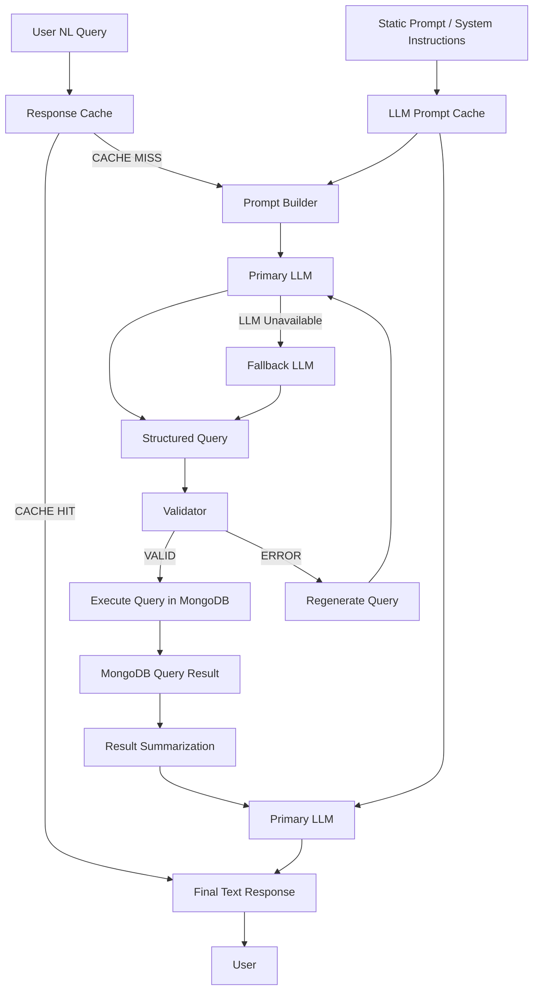
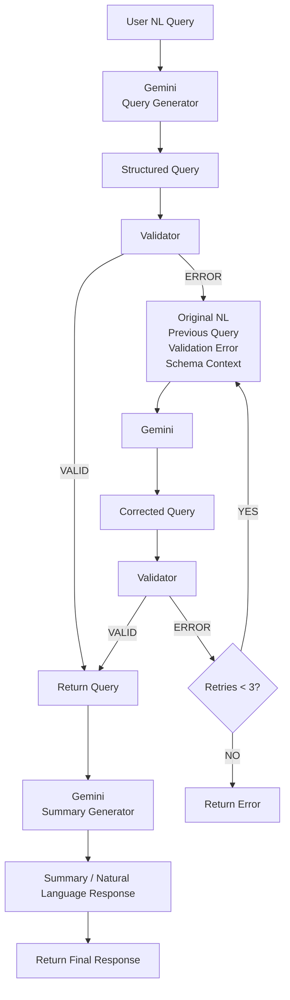

#### 4.1 Architecture level flow

```text
User
 ↓
FastAPI / Controller
 ↓
queryExecutor
 ↓
queryGenerator → Gemini
 ↓
Query Validator
 ↓
Repository
 ↓
MongoDB
 ↓
queryGenerator → Gemini
 ↓
Response
```

#### 4.2 Code Level Flow

```text
User
  ↓
POST /chat
  ↓
Controllers/userChat.py
  ↓
Services/queryExecutor.py
  ↓
queryGenerator.generateQuery()
  ↓
Gemini
  ↓
Generated MongoDB Aggregation Pipeline
  ↓
checkQueryStatus()
  ↓
mongoQueryValidator.validateQuery()
  │
  ├── Invalid
  │     ↓
  │   queryGenerator.regenerateQuery()
  │     ↓
  │   Validate Again
  │
  └── Valid
        ↓
      executeQueryInDb()
        ↓
      Repo/mongoDB.py
        ↓
      MongoDB
        ↓
      Query Result
        ↓
      resultToUser()
        ↓
      queryGenerator.summarizeResult()
        ↓
      Gemini
        ↓
      Final Text Response
        ↓
      User
```


#### 4.2 Proposed architecture 





#### 4.3 Implemented architecture 


