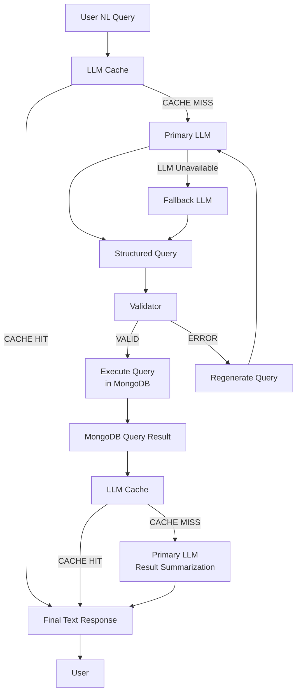
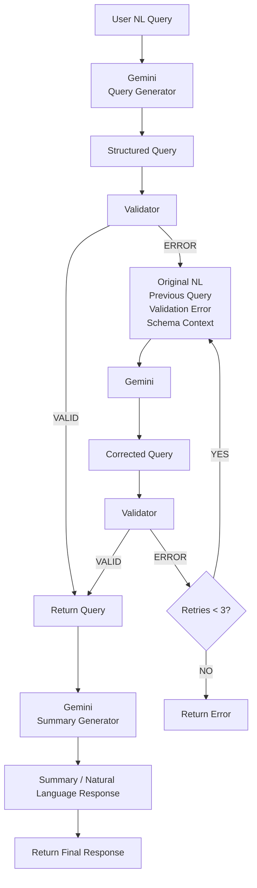

## INDEX

1. **Objective**  
    1.1 Project Name  
    1.2 Purpose  
    1.3 Scope
    
2. **Modules**  
    2.1 Controller  
    2.2 Service  
    2.3 Repository  
    2.4 Supporting Components  
    2.5 Folder Structure
    
3. **Database**  
    3.1 Overview  
    3.2 Schema Metadata
    
4. **Application Flow**  
    4.1 Active Chatbot Flow  
    4.2 Main Application Flow  
    4.3 Proposed Architecture  
    4.4 Implemented Architecture
    
5. **LLM Integration**  
    5.1 Overview  
    5.2 Query Regeneration  
    5.3 Proposed LLM Features
    
6. **Query Generation & Validation**  
    6.1 Overview  
    6.2 Supported MongoDB Stages  
    6.3 Supported Operators  
    6.4 Schema and Field Validation  
    6.5 Query Regeneration
    
7. **Environment and Configuration**  
    7.1 API Keys  
    7.2 Python Dependencies
    
8. **Error Handling and Limitations**  
    8.1 Query Generation Errors  
    8.2 Query Validation Errors  
    8.3 Database Errors  
    8.4 Limitations
    
9. **Future Enhancements**  
    9.1 Structured Schema Definition  
    9.2 Function Calling for Query Validation  
    9.3 LLM Response Caching  
    9.4 Fallback LLM Provider  
    9.5 Expanded Machine-Data Analysis
## 1. Objective
##### 1.1 Project Name
AI-Powered Machine Data Analysis

##### 1.2 Purpose
- This AI-powered machine data analysis prototype enables users to query existing machine data using natural language.
- The system retrieves relevant machine data from MongoDB and uses an LLM to generate a concise, natural-language response based on the retrieved results.

The current prototype focuses on direct analysis of existing machine data, such as:
- Values and measurements
- Counts and aggregations
- Trends
- Patterns
- Other directly observable information from the available data

>The current scope does not focus on root-cause analysis, failure diagnosis, or prescriptive recommendations.

##### 1.3 Scope 
The machine data is already available in MongoDB through an upstream process: Machine → PLC → MQTT → Data Cleaning → MongoDB 

The upstream data-ingestion process is outside the scope of this project. 
The current project focuses on: 
Natural-language interaction with machine data - MongoDB query generation - Query validation - Query execution - Natural-language summarization of query results 

## 2.Modules
##### 2.1 Controller

`Controllers/userChat.py`
- Receives the user's natural-language message.
- Passes the message to the service layer.
- Returns the response from the service layer.
User → `/chat` → Controller → Service Layer

#### 2.2 Service 

``` 
Services/
├── queryExecutor.py
├── queryGenerator.py
├── mongoQueryValidator.py
├── mistralExecutor.py
└── Prompts/
    ├── NL2NoSQL.md
    └── Summary.md
```
##### `queryExecutor.py`

Acts as the main orchestration component of the service layer. It coordinates
query generation, query validation, query execution, and result summarization
to process a user's natural-language question.

| Function | Description |
|---|---|
| `userNL2nosql2DB()` | Coordinates the complete flow from natural-language question to database query, validation, execution, and final result summarization. |
| `checkQueryStatus()` | Validates the generated MongoDB aggregation pipeline against the allowed schema fields and returns the validation status or error. |
| `executeQueryInDb()` | Passes the validated MongoDB aggregation pipeline to the repository layer for execution. |
| `resultToUser()` | Passes the original user question and database result to the result summarization function. |

``` 
                   Service Layer
                         │
                         ▼
                  queryExecutor.py
                         │
          ┌──────────────┼──────────────┐
          ▼              ▼              ▼
   queryGenerator   mongoQueryValidator   Repo
          │              │              │
          │         Validate Query       │
          │              │              ▼
          │              │           MongoDB
          │              │              │
          └──────────────┼──────────────┘
                         │
                         ▼
                 Result Summarization
                         │
                         ▼
                   User Response
```


##### `queryGenerator.py`

Handles interaction with the Gemini model for generating MongoDB
aggregation queries and producing natural-language summaries of
database results.

| Function                       | Description                                                                                                           |
| ------------------------------ | --------------------------------------------------------------------------------------------------------------------- |
| `generateQuery()`              | Generates a MongoDB aggregation pipeline from the user's natural-language question.                                   |
| `generateWithFallBackModels()` | Attempts query generation using alternative Gemini models when the primary model is unavailable.                      |
| `regenerateQuery()`            | Generates a corrected query using the previous query, schema, and validation error and user's natural language query. |
| `summarizeResult()`            | Converts the database result into a concise natural-language response.                                                |

##### `mongoQueryValidator.py`

Acts as the validation component of the service layer. It validates the
MongoDB aggregation pipeline generated by the query-generation component
before the query is executed against the database.

| Function | Description |
|---|---|
| `validateQuery()` | Validates the overall MongoDB aggregation pipeline, including its stages, fields, operators, and structure. |
| `_validate_expression()` | Validates expressions within the aggregation pipeline, including field references, operators, nested expressions, and values. |
##### `/Prompts`

Contains the prompt templates used by the LLM for query generation and
result summarization.

| File | Purpose |
|---|---|
| `NL2NoSQL.md` | Prompt used to generate MongoDB aggregation queries from natural-language questions. |
| `Summary.md` | Prompt used to generate the final natural-language response from the user's question and database result. |


#### 2.3 Repository 
##### `mongoDB.py`

Acts as the repository component for MongoDB data access. It executes the
MongoDB aggregation pipeline received from the service layer and returns the
query results.

| Function | Description |
|---|---|
| `executeQuery()` | Executes the provided MongoDB aggregation pipeline on the configured collection and returns the results as a list. |

#### 2.4  Supporting Components 

##### `mongoDB_connection.py`

Provides the MongoDB connection used by the application. It manages the
MongoDB client and provides access to the configured database and collection.

| Function            | Description                                                 |
| ------------------- | ----------------------------------------------------------- |
| `getClient()`       | Creates and returns the MongoDB client.                     |
| `getDatabase()`     | Returns the configured MongoDB database.                    |
| `getCollection()`   | Returns the configured MongoDB collection.                  |
| `closeConnection()` | Closes the MongoDB client connection and resets the client. |
##### `Schemametadata.json`
Contains metadata about the MongoDB collection used by the query-generation
and validation components. It defines the available fields, their data types,
and the configured indexes.
##### `main.py`
Acts as the main entry point of the FastAPI application. It creates the
FastAPI application, registers the API router, and currently performs the
CSV-based test-data preparation during application startup.
##### `dataProcessing.py`

Provides temporary utilities for preparing CSV test data before it is used
with MongoDB. The current implementation loads, checks, prepares, and can
optionally insert the data into MongoDB.

| Function | Description |
|---|---|
| `loadDataFrame()` | Loads the CSV data into a Pandas DataFrame. |
| `checkDataFrame()` | Displays the DataFrame shape, column types, and missing-value information. |
| `prepareDataFrame()` | Converts the `time_stamp` column to UTC datetime format. |
| `insertDataFrame()` | Inserts the prepared DataFrame records into the MongoDB collection. |
##### `mistralExecutor.py`
Contains an experimental Mistral-based implementation for generating
natural-language summaries from MongoDB results. This component is currently
on hold and is not part of the active project flow.

| Function            | Description                                                                                                    |
| ------------------- | -------------------------------------------------------------------------------------------------------------- |
| `summarizeResult()` | Uses the Mistral model to generate a concise natural-language summary from the user question and query result. |

##### `requirements.txt`
Contains the Python packages and their installed versions required by the
current prototype. It can be generated from the project's active Python
environment using `pip list`.


#### 2.5 Folder Structure 

```text
/
├── Controllers/
│   └── userChat.py
│
├── Repo/
│   └── mongoDB.py
│
├── Services/
│   ├── queryExecutor.py
│   ├── queryGenerator.py
│   ├── mongoQueryValidator.py
│   ├── mistralExecutor.py
│   └── Prompts/
│       ├── NL2NoSQL.md
│       └── Summary.md
│
├── Scripts/
│
├── main.py
├── dataProcessing.py
├── mongoDB_connection.py
├── Schemametadata.json
├── requirements.txt
└── .env
```

## 3. Database
#### 3.1 Overview 
The project currently uses **MongoDB** as the database for storing and retrieving machine data. The machine data is already available in MongoDB through an upstream data pipeline. The AI-powered analysis component uses this existing data to process natural-language questions and retrieve the required information. The current prototype works with the `live_data` collection.

The current prototype uses the following MongoDB database and collection:

| Component    | Value             |
| ------------ | ----------------- |
| Database     | `iiot_db`         |
| Collection   | `live_data`       |
| MongoDB Host | `localhost:27017` |

#### 3.2 Schema Metadata

The project uses `Schemametadata.json` to define the structure of the
`live_data` collection. It contains the available fields, their data types,
and the indexes defined for the collection.

The schema metadata is loaded by the service layer and is used to determine
which fields are allowed when validating generated MongoDB queries.

A sample document

```json
live_data:

{  
  speed_up_or_down: Double('100'),  
  act_production_kgs: Double('52.3538'),  
  set_average_speed: Double('20315.3'),  
  idle_time_minute: Double('0'),  
  remaining_pegs: NumberInt('1334'),  
  current_delivery_speed: Double('24.8207'),  
  set_speed_speedpattern: NumberInt('20300'),  
  machine_name: 'Machine 01',  
  average_spindle_speed: Double('19115.55'),  
  tgt_standard_eff: Double('12'),  
  ukg: Double('1.8411'),  
  tgt_ukg: Double('0'),  
  waste_kg: Double('0'),  
  current_spindle_speed: NumberInt('20411'),  
  spindle_utilization: Double('97.619'),  
  total_kwh: Double('96.3906'),  
  weight_per_spindle: Double('28.7027'),  
  tgt_gpss: Double('21.0596'),  
  ts_act: '2026-09-16 09:20:52.761',  
  tgt_production_eff: Double('0'),  
  avg_doff_min: Double('2'),  
  tgt_machine_uti: Double('0'),  
  act_gpss: Double('29.4028'),  
  no_of_doffs: Double('1'),  
  act_gpss_40s: Double('29.4028'),  
  air_consumption_cu_m: Double('9.534'),  
  count_ne: Double('39.5'),  
  mm_inv_heat_sink_temp: Double('161.7'),  
  machine_uti: Double('97.619'),  
  gpss: Double('28.7027'),  
  set_doff_length: Double('3500'),  
  production_in_hanks: Double('2.4997'),  
  pe_loss_percent: Double('0'),  
  shift_hour: '07:55',  
  production_eff: Double('97.619'),  
  production_in_meters: Double('1920'),  
  eup: Double('144.8414'),  
  tl_cycle_time: Double('112.1667'),  
  set_tpi: Double('21.1'),  
  power_fail_time_minute: Double('0'),  
  no_of_spindles: NumberInt('1824'),  
  total_kva: Double('72.0134'),  
  average_tpi: Double('20.9594'),  
  conv_ukg: Double('1.8411'),  
  doff_time_minute: Double('2'),  
  production_loss_kg: Double('0'),  
  production_eff_loss_percent: Double('0'),  
  shift_id: Double('1'),  
  conv_production_kgs: Double('52.3538'),  
  average_delivery: Double('23.1656'),  
  run_time_minute: Double('82'),  
  time_stamp: ISODate('2026-09-16T03:50:00.000Z'),  
  doff_remaining_time: Double('128.9195'),  
  expiry_date: ISODate('2026-10-30T18:30:00.000Z'),  
  machine_eff: Double('97.619'),  
  worked_spindle: Double('1780.5714'),  
  current_length: Double('696'),  
  tpm: Double('830.707'),  
  air_consumption_cfm: Double('4.106'),  
  production_kgs: Double('52.3538'),  
  conv_factor_40s: Double('1'),  
  shift_date: '2026-09-16',  
  tgt_production_kgs: Double('38.4127'),  
  tm: Double('3.3573'),  
  conv_gpss: Double('28.7027'),  
  set_spindle_speed: NumberInt('20411')  
}
```

## 4. Application Flow
#### 4.1 Active chatbot flow

```text
User
 ↓
FastAPI / Controller
 ↓
queryExecutor
 ↓
queryGenerator → Gemini
 ↓
Query Validator
 ↓
Repository
 ↓
MongoDB
 ↓
queryGenerator → Gemini
 ↓
Response
```


#### 4.1 Main Application Flow

```text
User
  ↓
POST /chat
  ↓
Controllers/userChat.py
  ↓
Services/queryExecutor.py
  ↓
queryGenerator.generateQuery()
  ↓
Gemini
  ↓
Generated MongoDB Aggregation Pipeline
  ↓
checkQueryStatus()
  ↓
mongoQueryValidator.validateQuery()
  │
  ├── Invalid
  │     ↓
  │   queryGenerator.regenerateQuery()
  │     ↓
  │   Validate Again
  │
  └── Valid
        ↓
      executeQueryInDb()
        ↓
      Repo/mongoDB.py
        ↓
      MongoDB
        ↓
      Query Result
        ↓
      resultToUser()
        ↓
      queryGenerator.summarizeResult()
        ↓
      Gemini
        ↓
      Final Text Response
        ↓
      User
```


#### 4.2 Proposed architecture 





#### 4.3 Implemented architecture 




## 5. LLM integration
#### 5.1 Overview 
The project currently uses **Gemini** as the LLM for natural-language
processing. The LLM is used at two stages of the analysis workflow.
1. **Query Generation** — converts the user's natural-language question
   into a structured MongoDB aggregation pipeline.
2. **Result Summarization** — converts the MongoDB query result and the
   original user question into a concise natural-language response.
The current implementation also uses fallback Gemini models when the
primary model is unavailable.

Primary Model
- `gemini-3.8-flash`

Fallback Models
- `gemini-3.7-flash`
- `gemini-3.6-flash`
- `gemini-3.5-flash`
- `gemini-3.5-flash-lite`
- `gemini-2.5-flash`
- `gemini-2.5-flash-lite


#### 5.2 Query Regeneration

If the generated MongoDB aggregation pipeline fails validation, the system
uses the LLM to generate a corrected query.

The regeneration request provides the original user question, previously
generated query, validation error, and schema context to the LLM.

### Flow

```text
Invalid Query
     ↓
Original NL Query
+ Previous Query
+ Validation Error
+ Schema Context
     ↓
Gemini
     ↓
Corrected Query
     ↓
Validator
     │
     ├── VALID → Execute Query
     │
     └── ERROR → Retry
                    ↓
                 Retry < 3?
                 ├── YES → Regenerate
                 └── NO  → Return Error
```


#### 5.3 Proposed LLM Features

The following capabilities are being considered for future development and
are not part of the current implementation.
The current implementation requests JSON output, but does not explicitly
provide a JSON schema describing the expected MongoDB query structure.

A potential improvement is to provide a structured schema through
`response_format` so that the generated response follows a predefined
structure.

Example:

```python
interaction = client.interactions.create(
    model="gemini-3.8-flash",
    input="...",
    response_format={
        "type": "text",
        "mime_type": "application/json",
        "schema": <MongoDB_Query_Schema>
    },
)
```

#### Gemini Docs used for reference 
- Another experimental feature is to call the validator function from the LLM itself [function_calling_from_llm](https://aistudio.google.com/docs/function-calling)
- [Generate_content](https://googleapis-python-genai-70.mintlify.app/api/models/generate-content)
- [Git_hub_example](https://github.com/google-gemini/api-examples/blob/13db4d358757eda215c546f431b372b303f71f3e/python/text_generation.py#L26-L32)


## 6. Query Generation & Validation
#### 6.1  Overview

The query-generation component converts the user's natural-language question
into a MongoDB aggregation pipeline according to the rules defined in the
`NL2NoSQL.md` prompt.

The generated query must use only the available schema fields and supported
MongoDB operations. The prompt also contains rules for interpreting machine
metrics, dates, machine filters, and other domain-specific fields.

The generated response is returned as a JSON-formatted MongoDB aggregation
pipeline without additional explanation or Markdown.
#### 6.2 Supported MongoDB Stages
The query validator currently allows the following MongoDB aggregation
stages:

| Stage | Purpose |
|---|---|
| `$match` | Filters documents based on specified conditions. |
| `$group` | Groups documents and performs aggregation operations. |
| `$project` | Selects or transforms fields in the pipeline output. |
| `$sort` | Sorts the pipeline results by specified fields. |
| `$limit` | Limits the number of documents returned. |
| `$skip` | Skips a specified number of documents. |
| `$unwind` | Deconstructs an array field into separate documents. |
| `$count` | Counts the documents passing through the pipeline. |

#### 6.3 Supported Operators
The query validator currently allows the following MongoDB operators within
the generated aggregation pipeline:

| Operator    | Purpose                                                            |
| ----------- | ------------------------------------------------------------------ |
| `$eq`       | Checks whether values are equal.                                   |
| `$ne`       | Checks whether values are not equal.                               |
| `$gt`       | Checks whether a value is greater than another value.              |
| `$gte`      | Checks whether a value is greater than or equal to another value.  |
| `$lt`       | Checks whether a value is less than another value.                 |
| `$lte`      | Checks whether a value is less than or equal to another value.     |
| `$in`       | Checks whether a value matches one of the specified values.        |
| `$nin`      | Checks whether a value does not match any of the specified values. |
| `$and`      | Combines multiple conditions using logical AND.                    |
| `$or`       | Combines multiple conditions using logical OR.                     |
| `$not`      | Negates a condition.                                               |
| `$avg`      | Calculates the average of values.                                  |
| `$sum`      | Calculates the sum of values.                                      |
| `$min`      | Returns the minimum value.                                         |
| `$max`      | Returns the maximum value.                                         |
| `$first`    | Returns the first value encountered.                               |
| `$last`     | Returns the last value encountered.                                |
| `$push`     | Adds values to an array.                                           |
| `$add`      | Adds values together.                                              |
| `$subtract` | Subtracts values.                                                  |
| `$multiply` | Multiplies values.                                                 |
| `$divide`   | Divides values.                                                    |
#### 6.4 Schema and Field Validation

The validator uses the fields defined in `Schemametadata.json` to determine
which database fields are available to the generated MongoDB pipeline.

The generated query is checked to ensure that referenced fields exist in the
available schema or were created by an earlier pipeline stage.

The validator also tracks the fields available at each stage of the pipeline,
so fields created or removed  stages such as `$group` and `$project` .
#### 6.5 Query Regeneration

When a generated query fails validation, the system sends the original user
question, the previously generated query, the validation error, and the
schema context to the LLM.

The LLM uses this information to generate a corrected MongoDB aggregation
pipeline, which is then passed through the validator again.

Query regeneration is limited to a maximum of three attempts in the current
implementation.

## 7. Environment and configuration
#### 7.1 API Keys

The application uses API keys for communication with external LLM services.
The keys are loaded from environment variables rather than being directly
embedded in the source code.

| Service | Environment Variable | Status |
|---|---|---|
| Gemini | `GEMINI_API_KEY` | Active |
| Mistral | `MISTRAL_API_KEY` | Experimental / On Hold |

The API keys are stored in the `.env` file and should not be exposed or
committed to the source repository.

#### 7.2 Python Dependencies 

| Package         |   Version | Purpose                                                                        |
| --------------- | --------: | ------------------------------------------------------------------------------ |
| `fastapi`       | `0.141.1` | Provides the REST API framework.                                               |
| `uvicorn`       |  `0.53.0` | Runs the FastAPI application.                                                  |
| `google-genai`  |  `2.23.0` | Provides Gemini API integration for query generation and result summarization. |
| `pymongo`       |  `4.18.1` | Provides MongoDB connectivity and database operations.                         |
| `pandas`        |   `3.0.5` | Used by the temporary CSV test-data preparation utility.                       |
| `python-dotenv` |   `1.2.3` | Loads API keys and other environment variables from `.env`.                    |
| `mistralai`     |  `2.10.1` | Provides Mistral API integration; currently experimental/on hold.              |
| `pydantic`      |  `2.13.5` | Used for data validation/model definitions and API-related structures.         |

## 8. Error handling and Limitations 
#### 8.1 Query Generation Errors

The query-generation component handles errors that occur while communicating
with the Gemini API during MongoDB query generation.

The primary Gemini model is attempted first. If the request fails with one
of the configured retriable HTTP status codes, the system attempts query
generation using the configured fallback Gemini models.
Retriable Errors
The following HTTP status codes trigger the fallback-model mechanism:

| Status Code | Description                  |
| ----------- | ---------------------------- |
| `429`       | API rate limit / quota error |
| `500`       | Internal server error        |
| `503`       | Service unavailable          |
| `504`       | Gateway timeout              |
##### Query Generation Flow

```text
User Query
    ↓
Primary Gemini Model
    │
    ├── Success → Generated Query
    │
    └── Retryable Error
            ↓
       Fallback Models
            │
            ├── Success → Generated Query
            │
            └── All Fail → Error
```


#### 8.2 Query Validation Errors

Generated MongoDB aggregation pipelines are validated before they are
executed against the database.

If the generated query fails validation, the validation error is passed back
to the query-generation component along with the original user question,
previously generated query, and schema context.

The LLM then generates a corrected query, which is validated again.

```text
Generated MongoDB Query
        ↓
   Query Validator
        │
   ┌────┴─────┐
   │          │
 VALID      INVALID
   │          │
   ↓          ↓
Execute    Regenerate
              Query
                ↓
            Validate
                ↓
              ...
```             
#### 8.3 Database Errors

MongoDB operations are handled through the repository layer
(`Repo/mongoDB.py`).

The service layer passes the validated MongoDB aggregation pipeline to the
repository, which executes the pipeline against the configured collection.

```text
Validated Query
      ↓
executeQueryInDb()
      ↓
Repo/mongoDB.py
      ↓
MongoDB
      │
      ├── Success → Query Result
      │
      └── Exception → Service-layer Error Handling
```

#### 8.4 Limitations 

1.The current system focuses on directly observable information from machine  
data, such as:
- Values
- Counts
- Aggregations
Root-cause analysis, failure diagnosis, and prescriptive recommendations are  
not currently implemented.

2.Gemini Dependency
The active implementation depends on Gemini for query generation, query  
regeneration, and result summarization.
Fallback models are currently limited to the configured Gemini models.

3.Mistral Integration
A Mistral-based implementation exists in the project but is currently on  
hold and is not part of the active execution flow.

4.Data validation 
The current validator just validates as per the schema provided bye the metadata.json and does not validate the values. This causes the users to provide values as per the document includes names, date, time formats.


## 9. Future  Enhancements 

The following enhancements are planned or being considered for future
versions of the project. These features are not part of the current active
implementation unless explicitly stated otherwise.

#### 9.1 Structured Schema Definition

Introduce an explicit response schema for LLM-generated MongoDB queries.
Instead of requesting only JSON-formatted output, the LLM response can be
constrained using a defined schema for the expected MongoDB aggregation
pipeline structure.
This can improve consistency and make the generated output easier to
validate and process.
#### 9.2 Function Calling for Query Validation

Expose the existing query-validation functionality as an LLM-callable
function.
The LLM could request the application to execute the validation function,
after which the application would return the validation result to the LLM.

```text
LLM
 ↓
Generated Query
 ↓
Function Call: validate_query()
 ↓
Application
 ↓
MongoQueryValidator
 ↓
Validation Result
 ↓
LLM
```


#### 9.3 LLM Response Caching
Introduce caching for repeated LLM requests.
Potential caching points include:
1. Natural-language query → generated MongoDB query
2. Query result + user question → final summary
Caching could reduce repeated LLM calls for identical or equivalent requests.

#### 9.4 Fallback LLM Provider
Extend the fallback mechanism beyond Gemini models to support an alternative  
LLM provider.
The current project contains an experimental Mistral implementation, which  
is currently on hold.
A future implementation may use another LLM provider as a fallback when the  
primary provider is unavailable.

#### 9.5 Expanded Machine-Data Analysis
Extend the analysis capabilities beyond directly observable machine-data  
questions.
Potential future capabilities include:
- Predictive analysis
- Prescriptive recommendations
- Trends and analysis 
These capabilities would require additional data, analysis logic, and  
validation beyond the current prototype scope.

